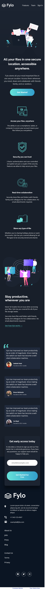

# Frontend Mentor - Fylo dark theme landing page solution

This is a solution to the [Fylo dark theme landing page challenge on Frontend Mentor](https://www.frontendmentor.io/challenges/fylo-dark-theme-landing-page-5ca5f2d21e82137ec91a50fd). Frontend Mentor challenges help you improve your coding skills by building realistic projects. 

## Table of contents

- [Overview](#overview)
  - [The challenge](#the-challenge)
  - [Screenshot](#screenshot)
  - [Links](#links)
- [My process](#my-process)
  - [Built with](#built-with)
  - [What I learned](#what-i-learned)
- [Author](#author)

## Overview

### The challenge

Users should be able to:

- View the optimal layout for the site depending on their device's screen size
- See hover states for all interactive elements on the page

### Screenshot

### Links

- Solution URL: [Solution URL here](https://github.com/Memeena/fylo-dark-theme-landing-page-master)
- Live Site URL: [Live site URL here](https://memeena.github.io/fylo-dark-theme-landing-page-master)

## My process

### Built with

- Semantic HTML5 markup
- CSS custom properties
- Flexbox
- CSS Grid
- Desktop-first workflow

### What I learned

- Having a reusable heading,paragraph to reuse in the code to make it DRY.
- Making the button to go little bit down using translate property to get the effect of moving the button down when clicked.
- In navigation section, changed the grid-template-columns from 2fr to 1fr to make it responsive.
- In Header section, linear gradient usage in the background image.
- In illustration section,using currentColor property to use the same colour as font-color when it is active and hovered.
- In illustration section, scaling the link to make it appear big when hovered.
- In review section, used before pesudo element for the double quotation, made it absoulte and then positioned them to fit the design requirements.
- In CTA section, throwing the error message when invalid email value is given in CSS by making it opacity to 0 and then switch it back when invalid property is invoked.
- In footer section, displayed them as flex and for inside layout used grid.

## Author

- Website - [Meenakshi](https://www.your-site.com)
- Frontend Mentor - [@Memeena](https://www.frontendmentor.io/profile/Memeena)

